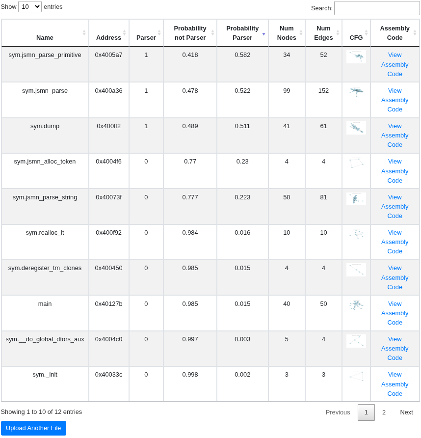
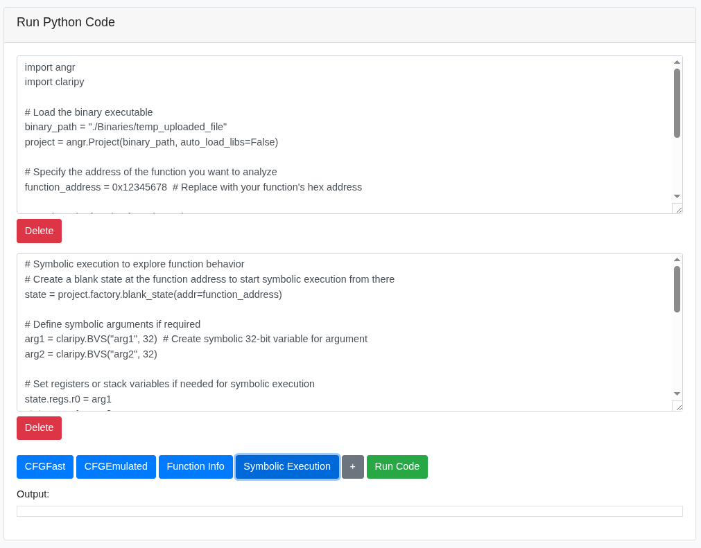

# Web Interface for ParserHunter

This project provides a simple web interface for classifying functions as a parser or not from a binary executable file using a Graph Neural Network (GNN) model. The application is based on the work presented in the paper *ParserHunter: Identify Parsing Functions in Binary Code*, which introduces a method for identifying parsing functions in binaries. The interface allows users to upload binary files, processes them to extract function information, and presents the results in a user-friendly format.

## Features

- Upload binary files for analysis.
- Extracts function names and addresses from the binary.
- Generates Control Flow Graphs (CFG) for each function and enriches it with node features.
- Classifies functions using a pre-trained GNN model.
- Provides downloadable links for CFG images and assembly code.

## Technologies Used

- **Flask**: A lightweight WSGI web application framework for Python, used for building the web interface.
- **Pandas**: A data manipulation and analysis library for Python, used for handling and processing data.
- **Subprocess**: For running external scripts and commands, facilitating the execution of various analysis tools.
- **Bootstrap**: For responsive web design, enhancing the user interface of the web application.
- **PyTorch**: An open-source machine learning library, used for implementing the Graph Neural Network (GNN) model.
- **PyTorch Geometric**: A library for deep learning on irregular structures like graphs, used for handling graph data.
- **Angr**: A Python framework for analyzing binaries, used for extracting control flow graphs and function information.
- **Radare2**: A set of utilities to examine binaries, used for identifying functions within the binary files.
- **Asm2Vec**: A tool for generating embeddings from assembly code, used for enriching the features of the functions being analyzed.
- **NetworkX**: A library for the creation, manipulation, and study of complex networks, used for handling control flow graphs.
- **Matplotlib**: A plotting library for Python, used for visualizing control flow graphs.

## Usage

To run this project, follow these steps:

### 1. Set Up Conda Environments

You need to create three different conda environments for the various functionalities of the project. Please refer to the requirements.txt file for detailed instructions on setting up each environment and the required packages.

### 2. Modify app.py

Before running the application, you need to specify the paths for the conda environments in the app.py file. Locate the following constants and update them with the correct paths to your conda environments:

- **CONDA_ENV_EXTRACT_LIST_FUNCTIONS**: Path to the Python executable in the environment for extracting functions.
- **CONDA_ENV_CREATE_GEOMETRIC_DATAS**: Path to the Python executable in the environment for creating geometric data and running GNN model inference.
- **CONDA_ENV_ASM2VEC_INFERENCE**: Path to the Python executable in the environment for Asm2Vec model inference.

Example:
```python
CONDA_ENV_EXTRACT_LIST_FUNCTIONS = '/home/marcos/.conda/envs/test-3.9-env/bin/python'
CONDA_ENV_CREATE_GEOMETRIC_DATAS = '/home/marcos/anaconda3/envs/test-3.10.0-env/bin/python'
CONDA_ENV_ASM2VEC_INFERENCE = '/home/marcos/anaconda3/envs/asm2vec/bin/python'
```

## Screenshots

Here are some screenshots of the web interface:

### 1. Function Classification Results
This screenshot shows the table of function classifications for a binary executable.



### 2. Symbolic Execution with Angr
This screenshot shows the box where the user can input code to perform symbolic execution using Angr.


